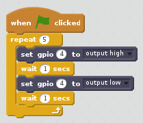

With Scratch 2 open and the GPIO extension added, connect your buzzer to a GPIO pin. In the code below, GPIO pin 4 is used.

- To sound the buzzer you need to set the pin high, using the following block.

- To turn the buzzer off you need to set the pin low, using the following block.

- Here's an example of a script that can be used to cause the buzzer to beep.

